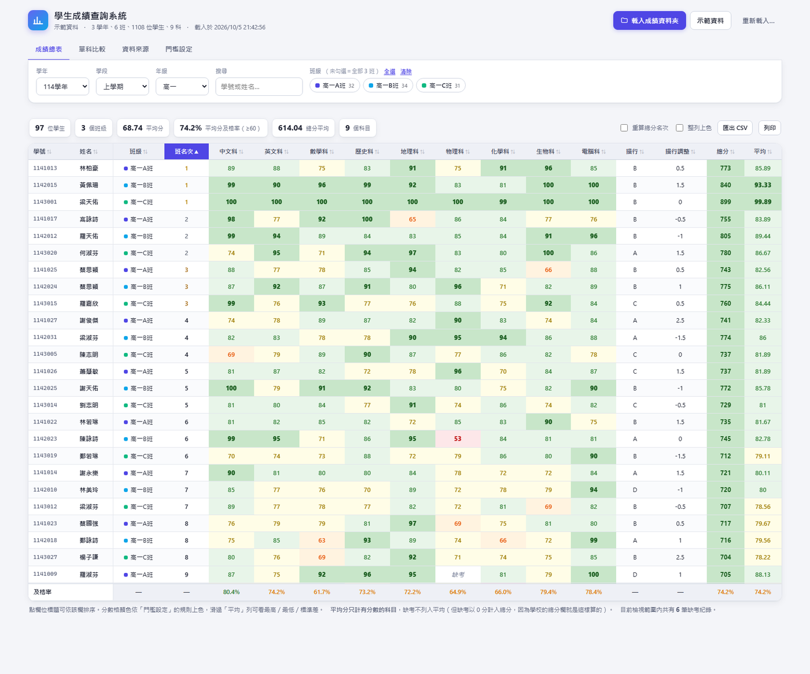
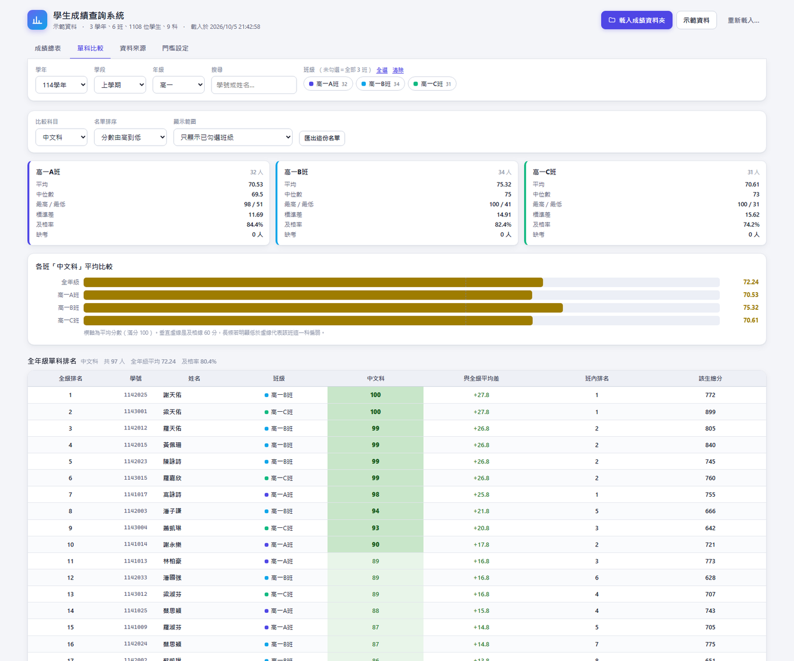

# 學生成績查詢系統

**Score Analysis App** — 讀取你原本的 Excel 成績檔，依學年、學段、年級、班級查詢、上色、排序與跨班比較。

> **純網頁、零依賴、離線可用。學生成績完全不會離開你的電腦。**

**`依賴 0`** ・ **`離線可用`** ・ **`資料不外傳`** ・ **`Node ≥ 18`（僅本機伺服器需要）**

---

## 目錄

- [這是什麼](#這是什麼)
- [螢幕截圖](#螢幕截圖)
- [核心特色](#核心特色)
- [快速開始](#快速開始)
- [資料夾結構要求](#資料夾結構要求)
- [Excel 欄位格式](#excel-欄位格式)
- [四個頁面](#四個頁面)
- [🔒 隱私與資料安全](#-隱私與資料安全)
- [常見問題](#常見問題)
- [技術架構](#技術架構)
- [測試](#測試)
- [專案結構](#專案結構)
- [已知限制](#已知限制)
- [授權](#授權)

---

## 這是什麼

每個學期結束，老師手上會有一堆 Excel 成績表——一個檔案一個班、按學年和學期分資料夾放著。
要回答「這次高一中文科全年級表現如何？」「哪一班數學特別弱？」「誰需要補救教學？」
通常得手動開好幾個檔案、複製貼上、自己算平均。

這支程式把那些檔案直接變成一個可以互動查詢的網頁：

- 選一個**學年資料夾**，它自動把底下所有 Excel 讀進來並分類
- 依**學年 → 學段 → 年級 → 班級**切換檢視
- 分數依你自訂的**門檻自動上色**（例如 60 分以下標紅）
- **點科目欄位**就依分數由高到低排序
- 選一個科目，讓**全年級同一科一起比**——各班平均、及格率、全年級排名、與平均差

它不是「上傳成績到雲端」的服務，而是**完全在你電腦的瀏覽器裡跑**的工具。

---

## 螢幕截圖

### 成績總表

門檻上色、點欄排序、每科平均與及格率。點欄位標題就能依該科由高到低排序。



### 單科比較

選一個科目（例如中文科），把全年級所有班級放在一起比：各班統計卡、各班平均長條圖（虛線是及格線）、全年級排名（含與全級平均差、班內排名）。



---

## 核心特色

| 功能 | 說明 |
|---|---|
| 📂 **吃整個資料夾** | 選一個上層資料夾，自動從路徑判斷學年／學段，從檔名判斷班級 |
| 🎨 **自訂分數門檻上色** | 可新增／刪除層級，自訂每層上下界、背景色、文字色。預設五色分層 |
| ↕️ **點欄排序** | 點欄位標題依該欄排序，再點一次反向。缺考自動排最後 |
| 🏫 **全年級同科比較** | 各班統計卡、平均長條圖（含及格線）、全年級排名、與全級平均差、班內排名 |
| 📊 **班級 × 科目矩陣** | 一眼看出「哪一班哪一科」是弱點 |
| 🔀 **多維度切換** | 學年 / 學段 / 年級 / 班級（可多選）連動篩選 |
| 🔍 **搜尋** | 用學號或姓名快速找人 |
| 💾 **自動記住資料** | 解析結果存在瀏覽器，下次打開直接看，不必重選資料夾 |
| 📤 **匯出 CSV / PDF** | 成績 PDF 依班級分頁、按學號排序並附學年／班級／學段／匯出日期標題；可匯出目前所選班級或目前範圍全部班級 |
| 📱 **可安裝成 App** | PWA，手機、平板可加到主畫面，可離線使用 |
| 🧩 **零依賴** | 沒有任何 npm 套件、沒有 CDN、沒有後端。所有程式碼都在這個 repo |
| 🔒 **資料留在本機** | 沒有雲端成績服務、資料上傳或追蹤；本機伺服器只負責提供程式檔案 |

### 解析器的容錯能力

真實的成績表格式很亂，所以解析器刻意寫得寬鬆：

- **標題列不一定要在第一列**——若上面有合併的大標題（例如「113學年 上學期 高一A班 成績表」），會自動往下找到真正的欄位標題列
- 「缺考」「缺席」「免修」「—」「X」等各種寫法 → 視為無分數，以灰色斜體顯示
- **0 分會正確算成 0 分**，不會被當成缺考
- 「85分」「60(補考)」也能正確解析
- **日期欄位不會被誤讀成分數**（例如 `2024-01-15` 不會變成 2024 分）
- 處理合併儲存格、共用字串表、多個工作表（自動挑最像成績表的那一個）
- 也支援 `.csv`（自動偵測逗號／分號／Tab）
- 自動判斷每欄的角色：學號／姓名／科目／備註資訊（操行、名次、總分…），判斷錯了可以在設定頁手動調整，**不需要重新載入檔案**

---

## 快速開始

### 需要什麼

- 一個瀏覽器：**Chrome / Edge 80+、Firefox 113+、Safari 16.4+**
  （用到瀏覽器原生的 `DecompressionStream` 來解壓 `.xlsx`）
- 要「安裝成 App」或離線使用，才需要 Node.js 18+ 來跑本機伺服器

### 方法一：直接開檔（最快）

在檔案總管雙擊 `index.html`，用 Chrome 或 Edge 開啟即可。功能幾乎完全可用。

### 方法二：用本機伺服器開（建議）

```bash
node serve.mjs
# 或
npm start
```

然後開啟 <http://127.0.0.1:8787/>

Windows 使用者也可以直接雙擊 **`start.bat`**。

用這種方式的好處：可以「安裝成 App」（瀏覽器網址列右側會出現安裝圖示）、可以離線使用。

### 想先看看畫面？

在網址後面加 `?demo=1`：

<http://127.0.0.1:8787/?demo=1>

會載入內建示範資料（程式即時產生的假資料，**不是**你的真實資料）。

`demo-data/` 內有用 Python 產生的合成 Excel 示範資料，可直接選該資料夾體驗「選資料夾」的完整流程：

```
demo-data/          ← 選這一個
├── 112學年/
├── 113學年/
└── 114學年/
```

---

## 資料夾結構要求

程式會**直接吃整個學年資料夾**，並自動從路徑判斷學年與學段，從檔名判斷班級：

```
113學年\                    ← 第一層＝學年
├── 上學期\                 ← 第二層＝學段
│   ├── 高一A班.xlsx        ← 一個檔案＝一個班級
│   ├── 高一B班.xlsx
│   └── 高一C班.xlsx
└── 下學期\
    ├── 高一A班.xlsx
    └── 高一B班.xlsx
```

要載入多個學年，就把它們放在**同一個上層資料夾**裡，然後選那個上層資料夾：

```
成績資料\                   ← 選這一個
├── 112學年\...
├── 113學年\...
└── 114學年\...
```

選好之後，畫面上的「學年」下拉選單就會出現所有學年，可以直接切換。
也支援「學年\學段\年級\班級檔案.xlsx」結構，例如 `2025-2026\第一段\初一\初一仁.xlsx`；`第一段`、`第二段`、`第三段` 會辨識為學段，下一層辨識為年級。

> 年級是從班級名稱自動推導的，支援 `高一`/`高二`/`高三`、`中一`～`中六`、`初一`/`初二`/`初三`、
> `小一`～`小六`、`S1`～`S6`、`F1`～`F6`、`Form 1` 等常見寫法。

---

## Excel 欄位格式

第一列是標題列，欄位順序不拘，但建議長這樣：

| 學號 | 姓名 | 中文科 | 英文科 | 數學科 | … | 操行 | 操行調整 | 總分 | 名次 |
|---|---|---|---|---|---|---|---|---|---|
| 1141013 | 林柏豪 | 89 | 88 | 75 | … | B | 0.5 | 773 | 1 |

程式會**自動判斷**每一欄的角色：

- **學號／姓名**：依欄位名稱辨識（學號、學籍號、座號、姓名、學生姓名…）
- **姓名前綴學號**：若學號欄空白，會從 `1.陳大文` 這類姓名前綴擷取學號 `1`，並在姓名欄只顯示 `陳大文`
- **科目**：數值比例高的欄位自動當成科目
- **基本操行／調整操行**：原始欄位預設隱藏，可開關顯示；兩者相加後以「操行總分」呈現
- **名次／總分**：自動排除，不列入科目計算（但仍可選擇顯示）
- 判斷錯了的話，到「門檻設定」→「科目欄位」手動勾選即可，**不需要重新載入**

### 科目代碼格式

也支援以數字作為科目欄標題、並在 A 欄列出「代碼.科目名稱」的格式，例如：

| 科目 | 姓名 | 1 | 2 | 3 |
|---|---|---:|---:|---:|
| 1.品德與公民 | 學生甲 | 85 | 80 | 90 |
| 2.宗教 | 學生乙 | 70 | 75 | 65 |

程式會先用代碼從 A 欄查出每份檔案的科目名稱，再按正規化後的科名跨班配對。因此欄位順序或科目數量不同時仍可比較；同一代碼若在不同班代表不同科目，會分開處理，不會錯比。沒有修讀該科的班級不會被當成 0 分，也不會把不同課程硬套進固定的 1–13 對照表。

### 關於總分與平均的計算慣例

- **總分**預設讀取 Excel 裡的值；也可以勾「重算總分名次」改成用各科加總
- **平均分**只計**有分數的科目**，缺考不列入平均
- 缺考以 0 分計入總分（因為學校的總分欄通常就是這樣算的）
- 因此**「總分」不能直接和及格線比**（總分滿分是「科目數 × 100」）。
  程式判斷及格率時，總分欄是以**個人平均分**為準，這也是學校的標準算法
- 總分與及格率預設隱藏；在成績總表或單科比較頁勾選「顯示總分／顯示及格率」即可同步開啟，設定會保存在本機
- 目前選取範圍內全體學生都沒有分數的科目會自動隱藏，避免將未開設科目誤顯示為全員缺考

---

## 四個頁面

### 成績總表

- 每一科一格，依門檻自動上色
- **點欄位標題** → 依該欄排序；再點一次反向（點「中文科」就從最高分排到最低分）
- 表格最下方的每科**平均列**預設隱藏，可開關顯示（滑過平均數可看最高、最低、標準差、缺考人數）；及格率也可獨立開關
- **顯示基本／調整操行**可切換兩個原始欄位；「操行總分」為基本操行與調整操行相加的結果
- 「重算總分名次」：用各科加總取代 Excel 裡的總分與名次
- 「整列上色」：整列上色，方便一眼掃出成績落後的學生
- 班名次放在成績與資訊欄之後
- 「匯出 CSV」「匯出 PDF」；成績 PDF 會依班級分頁、按學號排序，並附上學年、班級、學段與匯出日期。可匯出目前選取班級，或用「全部班級 PDF」匯出目前學年／學段／年級範圍的所有班級
- 單科比較頁亦可匯出 PDF，標題會包含學年、比較範圍、學段與匯出日期；按下匯出後，在瀏覽器列印視窗選擇「另存為 PDF」
- 再次匯入資料夾時，先比較目前與新資料，列出新增／移除／變更的檔案、學生及欄位；確認後才取代目前資料，取消則保留原資料
- 年級選單會保留所選學年及學段下的所有年級，可直接由一個年級切換到另一個年級

### 單科比較 ← 「全高一中文科一起比」

1. 上方選「比較科目」（例如中文科）
2. 「顯示範圍」選 **本學年本學段全部班級（全年級）**
3. 就會得到：
   - **各班統計卡片**：平均、中位數、最高／最低、標準差、缺考人數；可選擇顯示及格率
   - **各班平均長條圖**：一眼看出哪一班這一科特別弱（虛線是及格線）
   - **全年級單科排名**：全級排名、學號、姓名、班級、分數、**與全級平均差**、班內排名；可選擇顯示該生總分
   - **各班各科平均對照表**：班級 × 科目的矩陣，快速找出「哪一班哪一科」是弱點

### 資料來源

- 每個檔案的解析結果（學年、學段、班級、人數、科目數、使用的工作表）
- 所有解析問題與提醒，例如某個檔案讀取失敗、某班重複放了兩份、某生的「總分」與各科加總不一致
- 分頁標籤上會顯示需要注意的問題數量（不必切到該頁也看得見）

### 門檻設定

- **及格線**：預設 60，用來算及格率
- **分數顏色門檻**：可新增／刪除層級，自訂每層的上下界、背景色、文字色、說明。
  預設五層（<60 紅、60–69 橙、70–79 黃、80–89 綠、90+ 深綠）。
  按「五色分層」可依你設定的及格線重新產生五層。
- **科目欄位**：勾選哪些欄位要當成科目
- 所有設定會自動記住

---

## 🔒 隱私與資料安全

這是這個專案最重要的設計決定。

**學生成績是個人資料。** 所以：

- ❌ **沒有雲端成績服務或上傳**。Excel 與解析結果不會被送到網際網路上的服務
- ❌ **沒有分析、追蹤、遙測、廣告**
- ✅ 所有解析都在你的瀏覽器裡完成
- ✅ 解析結果只存在你自己電腦的瀏覽器儲存空間（IndexedDB），隨時可以一鍵清除
- ✅ Service Worker 只快取**程式本身**，不快取任何成績資料
- ℹ️ 使用 `node serve.mjs` 時，瀏覽器會透過本機位址讀取程式檔案；這不是雲端服務，也不會上傳成績

### ⚠️ 如果你要 fork 或修改這個專案

**不要把真實的成績檔放進這個 repo，也不要提交到 Git。**

`.gitignore` 會忽略一般位置的 Excel／CSV；為了讓合成測試資料可供測試，`demo-data/` 中的 Excel 是例外，會被 Git 看見。請把真實資料放在 repo 外的資料夾，推送前執行 `git status --short`，確認沒有成績檔或其他個人資料。

---

## 常見問題

**Q：為什麼每次開網頁都要重新選資料夾？**
瀏覽器基於安全理由，不允許網頁自動讀取你硬碟裡的資料夾。
不過程式會把**已經解析好的資料**存在瀏覽器裡，下次打開會自動還原，不需要重新選。
只有在 Excel 內容有更新時，才需要再選一次資料夾。

**Q：我的成績資料會被上傳嗎？**
不會。見上面的[隱私與資料安全](#-隱私與資料安全)。

**Q：畫面一片空白怎麼辦？**
正常情況下，如果程式出錯，畫面最上方會出現紅色的錯誤橫幅。
如果連橫幅都沒有，請按 `F12` 開啟主控台（Console），把紅色錯誤訊息貼到 issue。

**Q：可以給同事用嗎？**
可以。把整個資料夾複製給對方即可，資料仍然只留在各自的電腦上（他們需要自己選自己的資料夾）。

**Q：手機可以看嗎？**
可以。讓本機伺服器監聽區域網路介面後，手機連同一個 Wi-Fi 開啟電腦的 IP 位址：

```bash
node serve.mjs 8787 0.0.0.0
```

然後在手機開啟 `http://你的電腦IP:8787/`。只對可信任的區域網路開放，不要直接暴露到網際網路。
或把整個資料夾放到任何靜態網頁空間（GitHub Pages、內網 IIS／nginx 都行，因為它只是靜態檔案）。

**Q：為什麼「名次」跟我算的不一樣？**
每一份 Excel 就是一個班，所以檔案裡的「名次」是**班內名次**，程式把它顯示為「班名次」。
跨班的全年級排名請看「單科比較」頁。

**Q：一定要用 Node.js 嗎？**
不用。只有「安裝成 App / 離線使用」才需要本機伺服器。直接雙擊 `index.html` 就能用大部分功能。

---

## 技術架構

```
瀏覽器
├── index.html          介面骨架（含一個非 module 的錯誤攔截器）
├── css/style.css       樣式（含列印樣式）
└── js/
    ├── xlsx.js         ← 零依賴 .xlsx 讀取器（ZIP + XML）與 CSV 解析
    ├── parse.js        ← 成績表語意解析：找標題列、判斷欄位角色、抽學生
    ├── loader.js       ← 批次載入資料夾 → 組成資料集
    ├── import-diff.js  ← 比較匯入前後的檔案、學生與欄位變化
    ├── store.js        ← IndexedDB 資料保存 + localStorage 設定
    ├── stats.js        ← 統計與顏色工具
    └── app.js          ← 介面主程式（無框架，原生 DOM）

serve.mjs               零依賴靜態伺服器（只為了能用 http:// 開啟以啟用 PWA）
sw.js                   Service Worker：只快取程式，不快取資料
```

### 想修改功能時，從這裡開始

| 想修改的內容 | 主要檔案 |
|---|---|
| 頁面文字、按鈕、篩選器或對話框 | `index.html` |
| 篩選、表格、排序、匯入流程、CSV／PDF 匯出 | `js/app.js` |
| Excel 欄位辨識、科目名稱／代碼、學號與操行解析 | `js/parse.js` |
| 資料夾路徑、檔案讀取及組合成資料集 | `js/loader.js` |
| Excel `.xlsx` ZIP／XML 與 CSV 低階讀取 | `js/xlsx.js` |
| 匯入前後差異比較 | `js/import-diff.js` |
| 平均、及格率、分數格式及門檻上色 | `js/stats.js`、`js/app.js` |
| IndexedDB、預設顯示選項與本機設定 | `js/store.js` |
| 畫面外觀、響應式配置、列印／PDF 版面 | `css/style.css` |
| 離線快取資源清單 | `sw.js` |
| 對應功能的測試 | `test/integration.html`、`test/ui-harness.html` |

修改後先執行 `npm run check`；再啟動本機伺服器，開啟對應測試頁確認行為。

### 為什麼自己寫 xlsx 解析器，而不用 SheetJS？

1. **不需要 CDN，離線可用**——PWA 必須能離線，任何外部依賴都是弱點
2. **沒有第三方供應鏈風險**——這支程式要讀取學生成績
3. **`.xlsx` 就是 ZIP + XML**，而瀏覽器原生就有 `DecompressionStream`，實作範圍很小
4. **只需要讀取**，不需要寫入或公式計算

實作要點（都在 `js/xlsx.js`，約 400 行）：

- 手動解析 ZIP 中央目錄（含 ZIP64 擴充欄位），用 `DecompressionStream('deflate-raw')` 解壓
- 用 `DOMParser` 解析 `workbook.xml` / `sharedStrings.xml` / `styles.xml` / `worksheets/*.xml`
- 處理共用字串表、行內字串、合併儲存格（把左上角值填滿整個合併範圍，這對標題列辨識很重要）
- 讀 `styles.xml` 的 `numFmtId` 判斷日期格式，把 Excel 序列值轉成可讀日期，避免日期欄位被誤讀成分數

### 沒有框架

介面用原生 DOM 與 ES module 寫成，沒有 React / Vue、沒有打包工具、沒有編譯步驟。
優點是任何人都能直接看懂並修改，而且十年後這些檔案還是能跑。

---

## 測試

先啟動伺服器（`node serve.mjs`），然後用瀏覽器開啟以下頁面，結果會直接顯示在畫面上。

| 測試頁 | 內容 | 如何確認 |
|---|---|---|
| [`/test/integration.html`](test/integration.html) | 分數解析、標題列偵測、CSV、`.xlsx` 解析、科目代碼與資料集建構 | 測試結果會顯示在頁面上 |
| [`/test/persist.html?mode=write`](test/persist.html) → `?mode=read` | IndexedDB 寫入與跨次讀取（同一瀏覽器先 write 再 read） | 測試結果會顯示在頁面上 |
| [`/test/ui-harness.html`](test/ui-harness.html) | 篩選、排序、平均與操行開關、匯入比較、各班 PDF 分頁與學號排序、資料還原 | 測試結果會顯示在頁面上 |

> `ui-harness.html` 會清除該測試來源下的 IndexedDB 與 localStorage，以乾淨狀態跑測試。若瀏覽器中有重要的本機資料，請在隔離的瀏覽器設定檔或測試用瀏覽器執行。

### 語法檢查（改完程式一定要跑）

```bash
npm run check
# 或
node tools/syntax-check.mjs
```

**這一步不能省。** 開發過程中真的發生過一次：某個函式裡重複宣告了 `const subjects`，
這是致命語法錯誤，會讓**整個模組都不執行**——畫面變成一片空白，Console 只給一行訊息。
瀏覽器不會告訴你哪裡寫錯，但 `node --check` 會精準指出行號。

### 開發時踩到的兩個坑（留給未來的自己）

**1. 不要用 `--virtual-time-budget` 測這個 App**

headless Chrome 的虛擬時間會讓 `setTimeout` 瞬間完成，
但 **IndexedDB 的回呼永遠不會被觸發**。這會產生「資料存不進去」的**假性失敗**，
浪費好幾個小時去找一個不存在的 bug。

解決方式：`serve.mjs` 提供一個測試端點 `/slow?ms=N`（延遲 N 毫秒才回應），
測試頁把它放進 `` 來拖住 `load` 事件。
這樣 headless 瀏覽器截取結果時，非同步工作已經用**真實時間**跑完了。
測試跑完時把圖片換成 1×1 的 data URI，`load` 立刻放行，不必真的等 55 秒。

**2. 分頁內容是「延遲繪製」的**

為了避免每次調整篩選都重建全部四個分頁，只有**目前顯示的分頁**會被重繪。
所以：**不要讀取「非目前顯示分頁」的 DOM**，那裡可能是上一份資料的內容。
切換分頁時會自動重繪。
（唯一例外是分頁標籤上的問題數量徽章，它由 `refresh()` 無條件更新。）

---

## 專案結構

```
score-analysis-app/
├── index.html              介面骨架
├── css/style.css           樣式
├── js/                     應用程式（見上方「技術架構」）
├── icons/                  App 圖示（192 / 512 / apple-touch）
├── sw.js                   Service Worker
├── manifest.webmanifest    PWA 設定
├── serve.mjs               零依賴本機伺服器（含測試用 /slow 端點）
├── start.bat               Windows 雙擊啟動
├── package.json            只有 npm scripts，沒有依賴
├── .gitignore              含「擋掉真實成績檔」的防護規則
├── docs/                   README 用的螢幕截圖
├── demo-data/              合成示範 Excel 與 manifest.json
├── tools/                  語法檢查、示範資料及專案維護工具
└── test/
    ├── integration.html    整合測試
    ├── persist.html        持久化測試
    └── ui-harness.html     端對端互動測試
```

應用程式執行時不需要 `demo-data/` 或 `tools/`；但整合測試與 UI 測試會使用 `demo-data/` 的測試檔案，因此保留它們才能完整執行測試。

---

## 已知限制

- 不支援舊版 `.xls` 二進位格式（請用 Excel 另存為 `.xlsx`）
- 需要 Chrome / Edge 80+、Firefox 113+、Safari 16.4+
  （用到 `DecompressionStream` 解壓縮；不支援時會顯示明確的錯誤訊息）
- 「名次」顯示的是**班內名次**（因為一份 Excel 就是一個班）
- 學號若在 Excel 裡是數字格式，開頭補零的 `001` 會變成 `1`
  （這是 Excel 本身的限制，不是程式的問題；可在 Excel 中把該欄設成文字格式）
- 資料存在瀏覽器裡，所以換瀏覽器或清除瀏覽資料後需要重新載入
- 沒有編輯功能——這是**查詢**工具，不修改你的原始 Excel

---

## 授權

目前未指定授權條款（All rights reserved）。

如果你希望別人能自由使用、修改、再散布，可以加上 MIT 之類的授權條款。
需要我幫你補上 `LICENSE` 檔案的話跟我說。
